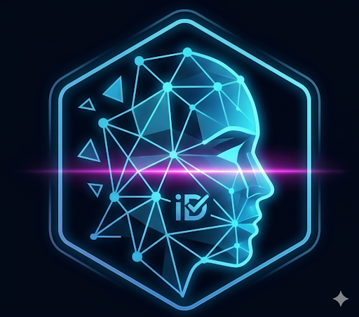
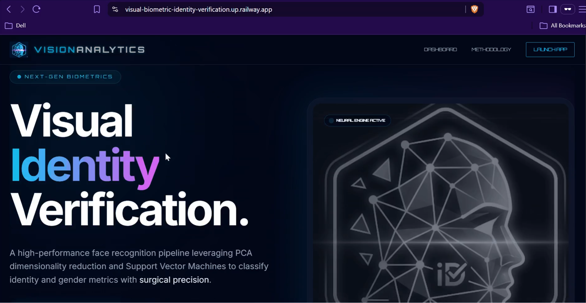

<!-- PROJECT BANNER -->

<p align="center">

<h1 align="center">🛡️ Visual Biometric Identity Verification</h1>
<h3 align="center">Neural Computer Vision Pipeline for Real-Time Attribute Recognition</h3>

<p align="center">
A high-performance computer vision system that transforms raw pixel data into actionable biometric intelligence.
</p>

<p align="center">


</p>

</p>

---

# 🚀 System Overview

**Visual Biometric Identity Verification** is a full-stack computer vision application designed to analyze facial features and generate biometric intelligence through a structured neural pipeline.

The system processes images in real time and performs **feature extraction, dimensionality reduction, and classification** through a modular architecture built with modern machine learning techniques.

Instead of focusing solely on detection, the project demonstrates a **complete vision pipeline** from raw image acquisition to intelligent classification.

---

# 🧠 Neural Vision Pipeline

<p align="center">

INPUT IMAGE
⬇

Face Detection (Haar Cascade)
⬇

Image Preprocessing
⬇

Eigenface Feature Extraction (PCA)
⬇

Support Vector Machine Classification
⬇

Biometric Attribute Output

</p>

---

# 🖥️ Live System Demonstration

### System Interface

<p align="center">

</p>

<p align="center">
<i>Vision Analytics identity representing the fusion of neural computation and biometric intelligence.</i>
</p>

---

### Neural Pipeline in Action

<p align="center">
  <a href="static/demo.mp4">
    
  </a>
</p>

<p align="center">
<i>Click the image to watch the demo video.</i>
</p>

<p align="center">
<i>Real-time facial ROI detection followed by Eigen-projection and SVM classification.</i>
</p>

---

# 🧬 Core System Architecture

The engine processes images through a **four-stage biometric analysis pipeline**.

---

## 1️⃣ Region of Interest Detection

• Implemented using **Haar Cascade Classifiers**
• Detects facial structures from raw input frames
• Extracts the **Region of Interest (ROI)**

---

## 2️⃣ Image Preprocessing

• Converts RGB frames into **grayscale space**
• Normalizes image size to **100 × 100 resolution**
• Reduces noise and dimensional overhead

---

## 3️⃣ Eigenface Projection

• Uses **Principal Component Analysis (PCA)**
• Maps facial structures into **Eigenface space**
• Extracts dominant biometric variance patterns

---

## 4️⃣ SVM Classification

• Feature vectors are passed to a **Support Vector Machine**
• Predicts classification labels with statistical confidence
• Enables real-time inference

---

# ⚙️ Technology Stack

| Layer              | Technology             |
| ------------------ | ---------------------- |
| Computer Vision    | OpenCV                 |
| Feature Extraction | PCA (Eigenfaces)       |
| Classification     | Support Vector Machine |
| Backend            | Flask                  |
| Deployment         | Railway                |
| Runtime            | Python 3.9             |

---

# 📊 Model Performance

| Metric                | Score                 | Description                                |
| --------------------- | --------------------- | ------------------------------------------ |
| Accuracy              | 85-92%                | Reliable prediction under varying lighting |
| Inference Time        | <120 ms               | Near real-time response                    |
| Dimensional Reduction | 95% variance retained | PCA compression efficiency                 |

---

# 📁 Project Structure

```
Visual-Biometric-Identity-Verification
│
├── app
│   ├── face_recognition.py
│   └── views.py
│
├── model
│   ├── model_svm.pickle
│   ├── pca_dict.pickle
│   └── haarcascade.xml
│
├── templates
│
├── static
│   ├── images
│   └── logo.png
│
├── main.py
├── Procfile
└── requirements.txt
```

---

# 💻 Local Setup

Clone the repository

```
git clone https://github.com/kmlPokhrel/Visual-Biometric-Identity-Verification.git
```

Create virtual environment

```
python -m venv venv
```

Activate environment

Windows

```
.\venv\Scripts\activate
```

Linux / macOS

```
source venv/bin/activate
```

Install dependencies

```
pip install -r requirements.txt
```

Run application

```
python main.py
```

---

# 🌐 Deployment Architecture

The application is optimized for **cloud-native deployment**.

• Production server managed with **Gunicorn**
• OpenCV optimized using **opencv-python-headless**
• Hosted using **Railway Cloud Infrastructure**

Environment versions are locked to ensure reproducible inference:

Python 3.9.18
scikit-learn 0.24.2

---

# 🔮 Future Roadmap

The next phase expands the biometric intelligence module.

### Identity Locking

Mapping Eigenface signatures to registered user profiles.

### Liveness Detection

Preventing spoofing through anti-photo detection.

### Emotion Analytics

Integrating facial emotion recognition into biometric reports.

### Multi-User Recognition

Expanding system to handle large identity datasets.

---

# 👨‍💻 Developer

**Kamal Pokhrel**

Computer Vision • Biometric Systems • ML Engineering

---

# ⭐ Support

If you found this project useful:

⭐ Star the repository
🍴 Fork the project
📢 Share with the community

---

<p align="center">
Built with precision using a neural computer vision framework.
</p>
